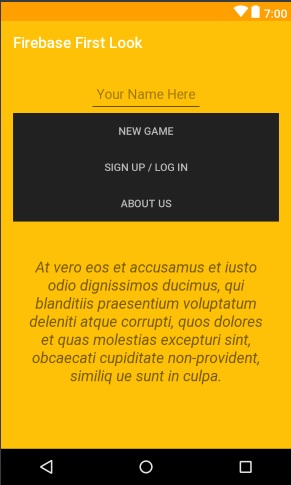
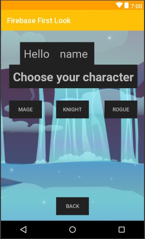
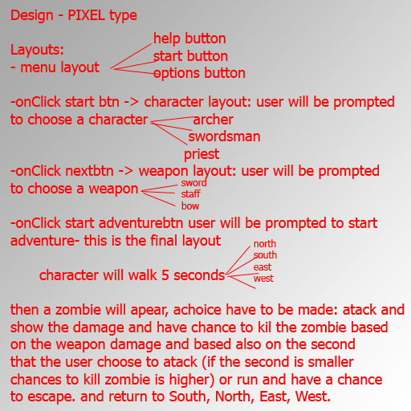

# ZombieTextGame
A mini project, coded in java, the initial idea is to create a funny game based on text.

### the app right now:
 
 

### the plan

- first layout: menu layout with 3 buttons: help, start and options
- onClick start button: will start intent with second layout which will contain: option for user to choose a character, open a chest and find a weapon(bow, axe, sword etc...), choose his strength points, agility points and inteligence points.
 - onClick to start adventure button: will start the survive adventure: character will walk 5 seconds and will see a zombie, a choice have to be made: attack or run. On attack will show the damage done/ On run will have a chance to run and hide awhile.

 ### here is the model:
  
